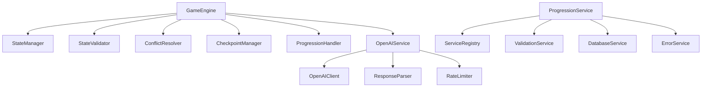
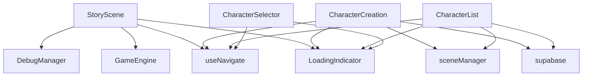

# AdventureBuildr Dependency Map

## Overview

This document maps out all dependencies between components, services, and utilities to ensure proper functionality during and after the reorganization process.

## Core Dependencies

### 1. Service Layer Dependencies



### 2. Component Dependencies



## Critical Paths

### 1. Game State Flow
```
GameEngine
└── StateManager
    ├── StateValidator
    ├── StateVersioner
    ├── ConflictResolver
    └── CheckpointManager
```

### 2. Progression Flow
```
ProgressionService
├── ServiceRegistry
├── ValidationService
├── DatabaseService
└── ErrorService
    └── DebugManager
```

### 3. UI Component Flow
```
StoryScene
├── GameEngine
├── LoadingIndicator
└── useNavigate
    └── react
```

## Shared Dependencies

### 1. Common Services
- `DebugManager`: Used across all services and components
- `ServiceRegistry`: Central service management
- `ValidationService`: Used by multiple services
- `DatabaseService`: Database operations

### 2. Common Components
- `LoadingIndicator`: Used in most UI components
- `ErrorBoundary`: Wraps major components
- `Menu`: Used in multiple views

### 3. Common Utilities
- `supabase`: Database client
- `types`: Type definitions
- `useNavigate`: Navigation hook

## Dependency Groups

### 1. Core Game Logic
```
core/
├── engine/
│   ├── GameEngine.ts
│   ├── StateManager.ts
│   ├── StateValidator.ts
│   ├── StateVersioner.ts
│   ├── ConflictResolver.ts
│   ├── SaveManager.ts
│   ├── CheckpointManager.ts
│   └── ProgressionHandler.ts
└── services/
    ├── progression/
    │   └── ProgressionService.ts
    └── openai/
        └── OpenAIService.ts
```

### 2. UI Components
```
components/
├── game/
│   ├── StoryScene.tsx
│   └── ChatHistory.tsx
├── progression/
│   ├── AttributePointsModal.tsx
│   ├── LevelUpModal.tsx
│   ├── ProgressBar.tsx
│   └── XPNotification.tsx
└── common/
    └── LoadingIndicator.tsx
```

### 3. Services
```
services/
├── ServiceRegistry.ts
├── ValidationService.ts
├── DatabaseService.ts
└── ErrorService.ts
```

## Circular Dependency Prevention

### 1. Service Layer
- Keep `ServiceRegistry` as single source of truth
- Use dependency injection where possible
- Avoid direct service-to-service references

### 2. Component Layer
- Use props for component communication
- Implement proper prop drilling
- Use context where appropriate

### 3. Type Layer
- Maintain centralized type definitions
- Avoid circular type imports
- Use interface segregation

## Migration Checklist

### 1. Pre-Migration
- [ ] Document all current dependencies
- [ ] Create backup of current structure
- [ ] Set up test environment
- [ ] Verify current functionality

### 2. During Migration
- [ ] Move files in dependency order
- [ ] Update import paths
- [ ] Test each component
- [ ] Verify service connections

### 3. Post-Migration
- [ ] Run full test suite
- [ ] Check build output
- [ ] Verify all features
- [ ] Monitor performance

## Dependency Validation

### 1. Build Time
```typescript
// tsconfig.json checks
{
  "compilerOptions": {
    "baseUrl": "src",
    "paths": {
      "@core/*": ["core/*"],
      "@components/*": ["components/*"],
      "@services/*": ["services/*"]
    }
  }
}
```

### 2. Runtime
```typescript
// Service initialization check
const validateDependencies = () => {
  const required = [
    'validation',
    'database',
    'openai',
    'progression'
  ];
  
  return required.every(service => 
    ServiceRegistry.getInstance().has(service)
  );
};
```

### 3. Testing
```typescript
// Dependency test suite
describe('Dependencies', () => {
  it('loads all required services', () => {
    expect(validateDependencies()).toBe(true);
  });
  
  it('maintains proper service order', () => {
    const registry = ServiceRegistry.getInstance();
    expect(registry.get('database')).toBeDefined();
    expect(registry.get('validation')).toBeDefined();
  });
});
```

## Version Control

```markdown
[2025-02-01] v1.0.0.44-alpha
- Added comprehensive dependency mapping documentation
- Type: Documentation
- Contributor: Bolt
```

## Monitoring

### 1. Build Metrics
- Track build time
- Monitor bundle size
- Check import depth
- Detect circular deps

### 2. Runtime Metrics
- Component load time
- Service initialization
- Error frequency
- Performance impact

## Documentation

### 1. Code Comments
- Document dependencies
- Note circular deps
- Add migration notes
- Update examples

### 2. README Updates
- Add dependency docs
- Update structure
- Include examples
- List best practices